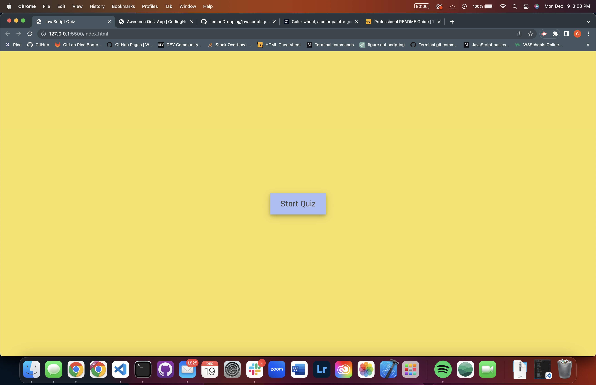
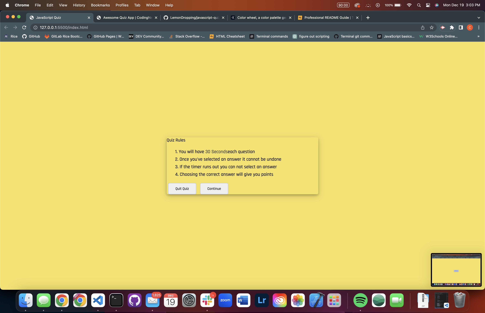
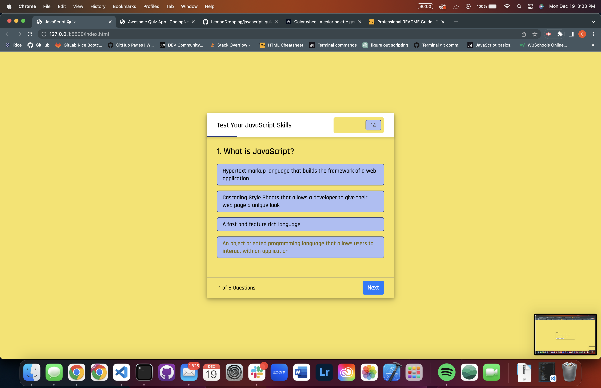

# JavaScript Quiz

## Description
- Used as a quiz to test your knowledge of basic JavaScript.
- This project was built to test my knowledge so far of JavaScript by creating a quiz.
- This project really helped me understand JavaScript much more because of the amount of time I spent debugging my JavaScript code.

## Usage
1. To start the quiz click on the star quiz button.
2. Then proceed to answer the questions to the best of your ability.
3. You will get your results after you finish the quiz. 

# Credits
- Made by Cole Roberts